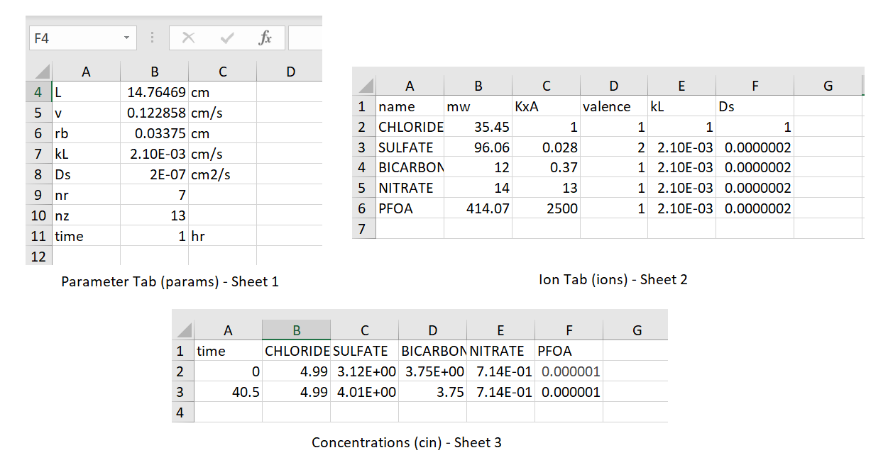
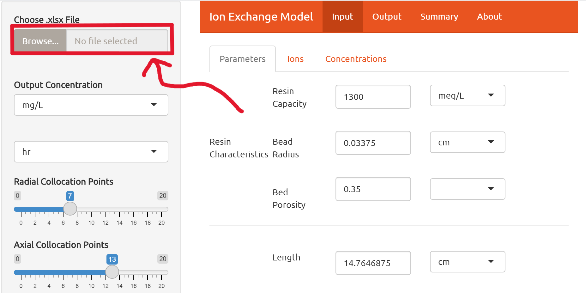
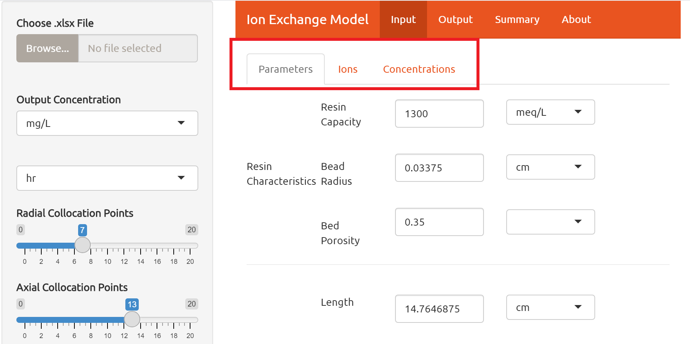
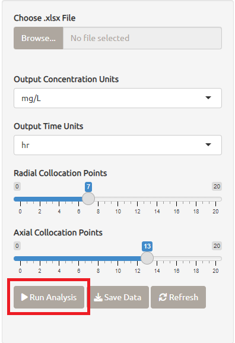
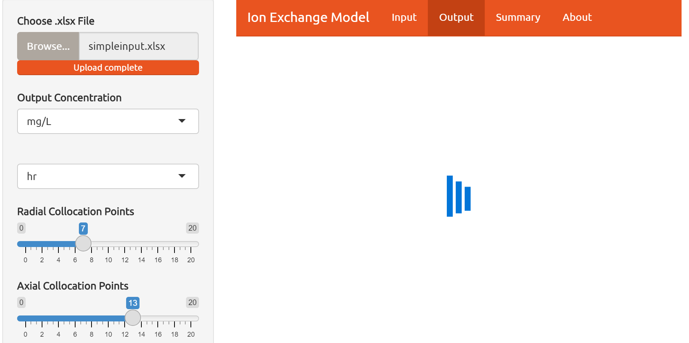
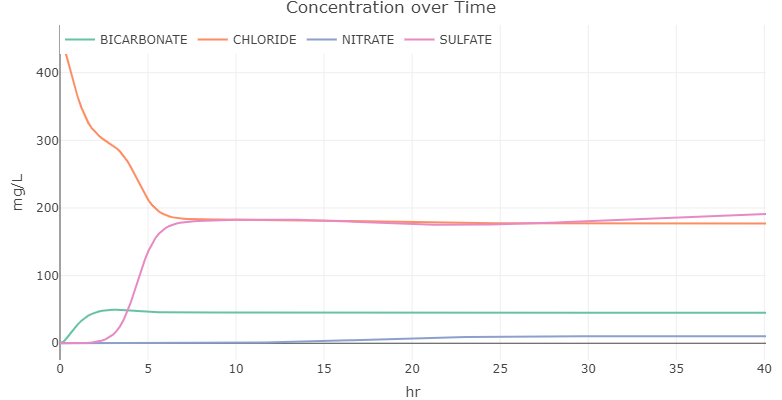

# Ion Exchange Modeling Tool

# Table of Contents
1. [Excel Formatting](#Excel)
2. [Quick Start](#QuickStart)

The Ion Exchange Model is a tool used to measure the concentration of PFAS chemicals in drinking water over time given the initial conditions. 'Ion Exchange' in this context refers to a particular method of drinking water treatment where the contaminated drinking water passes through a resin column and _____________. To read a further in depth analysis of the theory behind this model please check out ________.  This tool can be used to determine if Ion Exchange or another method like Granular Activated Carbon is the most efficient for a given water treatment facility.

## Excel Formatting 
The input for the excel file must be formatted like the one shown in figure 1 if the user wants to import data.

<figure>
    
    <figcaption>The excel file consists of three sheets: parameters of the system, the list of ions that the user is interested in along with their properties, and the list of concentrations for the ions at a given time. Each tab is broken down in detail in the features section of this document.</figcaption>
</figure>

&nbsp;

## Quick Start 

1. Click import file in the top left of the Interface

2. Change the parameters, ions, and initial concentrations in their respective tabs to receive different results

3.	Hit run button that’s at the bottom of the same side panel as the file import

4.	Switch to the output tab (There should be a loading “spinner” to let you know it’s running)

5.	Graph will appear

## Features

### Select Input Units

### Select Output Concentration Units

### Select Time Units

### Output Data

### Refresh

## Input Data Reference

### Parameters

The parameters tab is used to describe the physical constraints of the resin characteristics and column specifications. Some of these measurements, like Resin Capacity, can be nontrivial to measure so we have tried to supply a source where the user can find the information if they do not have it already.

##### **Resin Capacity - Q**
Resin Capacity is a measurement of the total capacity of ions that can be absorbed by a volume of resin. This capacity is expressed in quantity per unit volume. This value needs to be determined experimentally by titration.

##### **Bead Radius - rb**
Bead radius is the measurement of the distance of the bead resin center to the surface.

##### **Bed Porosity - EBED**
The bed porosity is the measure of a bed volume occupied by a solvent, in this case, usually PFAS chemicals. This factor is always between the values 0 and 1, where 0 represents a bed absent of a particular solvent and 1 is a bed where all the space is filled with that solvent.

##### **Length - L**
Length represents the distance along the outside of the cylinder that runs parallel with the flow of water.

##### **Velocity - v**
The Linear velocity that represents the distance one point along the water travels over a given period of time. The assumption here is that all particles in the flowing water move approximatley at the same velocity.

##### **Diameter**
The longest distance between one point to the other of the exiting hole.

##### **Flow Rate**
The flow rate represents the distance one unit volume travels through the cylinder over a given period of time. The assumption here is that all volumes in the flowing water move approximatley at the same flow.

##### **Radial Collocation Points - nr**
##### **Axial Collocation Points - nz**
##### **Volumetric and Linear Velocity**
There are two options for chosing the input velocity: Volumetric (Flow rate) or Linear. Both options are available in this tool. If volumetric velocity is chosen, then length, diameter, and flow rate must all be supplied before the analysis is ran. If linear velocity is chosen then the user only needs length and velocity. This is because the tool by default takes linear velocity and when a volumetric velocity is given then the flow rate must be converted to linear velocity.

### Ions
The ions tab is present in order to organize the chemicals that are present in the analysis. This tab can be updated in either excel or in the Ion Exchange app. The ions are added by row with the columns in order being name, molecular weight, KxA, valence, film transfer coefficient, and surface diffusion coefficient. Chloride, Sulfate, Bicarbonate, and Nitrate should always be in the ions tab.

##### Molecular Weight
The sum of all the masses in a molecule.
##### KxA

##### Valence
The number of electrons that a given element or chemical can lose.

##### **Film Transfer Coefficient - kL**
If you do not know how to find your film transfer coefficient you can find it here

##### **Surface Diffusion Coefficient - Ds**
The Surface Diffusion Coefficient is the proportion of 
If you do not know where or how to find the Surface Diffusion Coefficient you can find it here

### Initial Concentration

### Output Concentration
The output concentration is given in units of mass divided by volume, however, this number is also adjusted 
### Output Time
### Exporting Data

The Ion Exchange Model is meant to take the input of the users water treatment specifications as well as their ions they want to remove from the water and their concentrations before the ions enter the treatment process.

